# Hi! My name is Jack and I'm a developer/writer.

  
  

> _**End-to-end, open & open. Until every end-to-end flow is open to public.**_

Fullstack developer focused on AI-powered web apps, LLM systems, and open-source tools.

[Github page](https://vector-sophie-github-io.vercel.app/)

Small projects from time to time, most big projects are in orgs!

I like useful software, silly ideas that somehow work, and small projects that teach lessons.

## Featured Projects

**personal projects**

  
  
  
  

**team projects**

  
  
  

## Programming Languages

## Frontend

## Backend

## UI/UX

## AI

## Package Management

## DevOps & Deployment

## Open Source
I care about open source because it turns private learning into public infrastructure.  
I’m most interested in contributing to:
- Dev tools
- AI infrastructure
- Education-focused softwares

### My Contributions

## Contact
If you want to collaborate, talk shop, or build something questionable in a productive way:

**jay7math@gmail.com**  

Not interested in:
- Crypto miracles  
- “star my repos and back"
- "definitely not a malware!!! pls PR this mp4!!!"

## Languages
English: Literally the preferred choice in many scenarios.

Korean: Native language, i do poetry and short stories occasionally.

Chinese: Relearning(former YCT4)

## Social / Profiles

## OS

<picture>
  <source media="(prefers-color-scheme: dark)"srcset="images/breakout-dark.svg"/>
  <source media="(prefers-color-scheme: light)"srcset="images/breakout-light.svg"/>
  
</picture>

