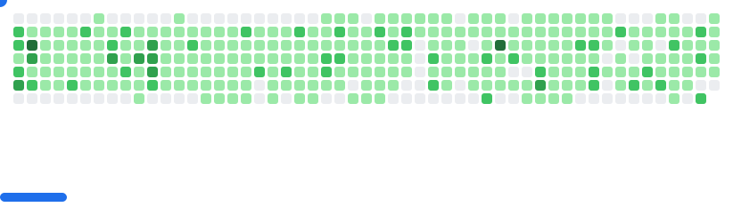

# Hi! My name is Jack and I'm a developer/writer.

  
  

Fullstack developer focused on AI-powered web apps, LLM systems, and open-source tools.

[Github page](https://vector-sophie-github-io.vercel.app/)

Small projects from time to time, most big projects are in orgs!

I like useful software, silly ideas that somehow work, and small projects that teach lessons.

## Featured Projects

**personal projects**

  
  
  
  

**team projects**

  
  
  

## Programming Languages
 
 
 

## Frontend & Deployment

## Backend & APIs

## UI/UX

## Data Science & AI

## Package Management

## CI/CD

## Open Source
I care about open source because it turns private learning into public infrastructure.  
I’m most interested in contributing to:
- Dev tools
- AI infrastructure
- Education-focused software

## Contact
If you want to collaborate, talk shop, or build something questionable in a productive way:

**jay7math@gmail.com**  

Not interested in:
- Crypto miracles  
- “star my repos and back"

## Languages
English: Literally the preferred choice in many scenarios.

Korean: Native language, i do poetry and short stories occasionally.

Spanish: Has talked with locals on the camino de santiago.

Chinese: Relearning(former YCT4)

## Social / Profiles

## OS

<picture>
  <source
    media="(prefers-color-scheme: dark)"
    srcset="images/breakout-dark.svg"
  />
  <source
    media="(prefers-color-scheme: light)"
    srcset="images/breakout-light.svg"
  />
  
</picture>

