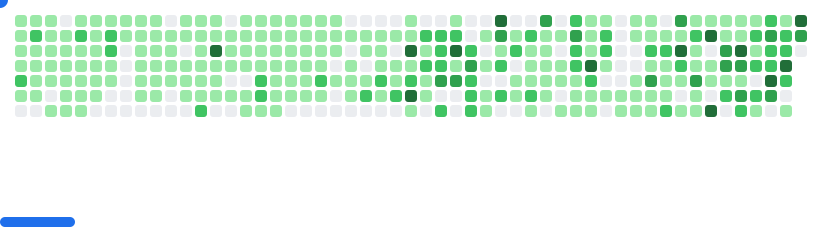

# hi! my name is Jack and I'm a developer/writer.

  
  

> _**End-to-end, open & open. Until every end-to-end flow is open to public.**_

I do about almost everything that interests me. Im not kidding.

[GitHub page](https://vector-sophie-github-io.vercel.app/)

small projects from time to time; most big projects are in orgs. I like useful software, silly ideas that somehow work, and small projects that teach lessons.

## projects

**personal**

  
  
  
  

**team**

  
  
  
  

**OSS**

  
  
  
  

## what i work on

### ai

- **local serving & inference** - running and evaluating models locally.
- **applied ml & dl** - classification, recommendations, and applied models.
- **federated learning** - experimenting with capability isolation and access to shared models.
- **dllms** - exploring diffusion language models and comparing them with autoregressive models.
- **model behavior & evaluation** - reproducible experiments on bias, reliability, and failure modes.

### agents

- **agentic workflows** - tool use, multi-step execution, and coding agents.
- **mcp, plugins & skills** - connecting agents to tools and extending their behavior.
- **tool selection & trust** - studying how agents choose between legitimate, malicious, and decoy tools.
- **privacy policy & information flow** - tracking sensitive data across tools, memory, and agent actions.
- **prompt injection** - measuring attacks and defenses across languages and tool surfaces.

### dev tools

- **cli & tui** - terminal-first tools and interfaces.
- **git & contribution tooling** - version control, review workflows, and open-source contribution tools.
- **agent infrastructure** - building, extending, and evaluating coding agents.

### low level

- **linux installation & recovery** - boot flows, dual boot, rollback, and hardware support.
- **test automation** - vm-based installation scenarios and system validation.
- **custom os** - exploring practical desktop systems and lower-level software.
- **native & cross-platform software** - building tools that run across windows, macos, and linux.
- **fuzzing** - experimenting with harness generation and execution feedback, including dllm-guided approaches.

### etc

- **web apps & services** - applications, apis, bots, and community tools.
- **games & simulations** - playable systems and interactive experiments.
- **terminal graphics** - rendering games, video, and 3d scenes in a terminal.

## what i work with

- **ai:** python, pytorch, transformers, vllm, scikit-learn
- **agents:** mcp, opencode, claude code, agent skills, playwright
- **dev tools:** rust, go, typescript, bun, opentui, git, github actions
- **low level:** linux, docker, qemu, clang, asan, ubsan, wasm
- **web & apps:** react, next.js, three.js, fastapi, postgresql, redis
- **research:** pytest, coverage tools, latex, jupyter

## OSS

I care about open source because it turns private learning into public infrastructure. I mostly gravitate toward developer tools, AI infrastructure, and software people can actually run and inspect.

## contact

If you want to collaborate, talk shop, coffee chat, or build something questionable in a productive way:

**jay7math@gmail.com**

Not interested in:

- Crypto miracles
- “star my repos and back”
- “definitely not a malware!!! pls PR this .exe!!!”
- “yo this massive security vulnerability of a program is the new trend try it out”

## languages

English: Literally the preferred choice in many scenarios. (OPIc AL)  
Korean: Native language; I do poetry and short stories occasionally.  
Chinese: Relearning (former YCT4).

## socials

[GitHub](https://github.com/VectorSophie) · [LinkedIn](https://www.linkedin.com/in/baeck-dongjae-368886368/) · [Naver](https://blog.naver.com/paranormalian) · [Velog](https://velog.io/@vectorsophie/posts) · [Ko-fi](https://ko-fi.com/vectorsophie)

<picture>
  <source media="(prefers-color-scheme: dark)" srcset="images/breakout-dark.svg" />
  <source media="(prefers-color-scheme: light)" srcset="images/breakout-light.svg" />
  
</picture>
