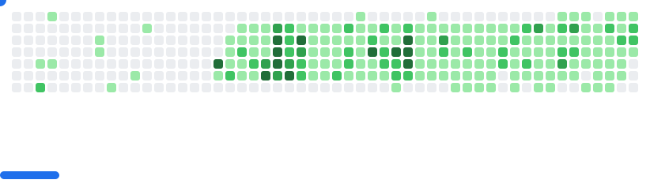

## Hi! My name is Jack and I'm a developer/writer.

i love silly projects, so always count me in.

i try to not work weekends tho

cat pics are always free so always ask.

ps. i have a very chaotic & silly commit message.

  

## Programming Languages
 
 
 
 

## Frontend & Deployment

## Backend & APIs

## Data Science & AI

## Package Management

## Social / Profiles

# Languages
English: Literally the preferred choice in many scenarios.

Spanish: Has talked with locals in Santiago.

Chinese: Relearning(former YCT4)

<picture>
  <source
    media="(prefers-color-scheme: dark)"
    srcset="images/breakout-dark.svg"
  />
  <source
    media="(prefers-color-scheme: light)"
    srcset="images/breakout-light.svg"
  />
  
</picture>

